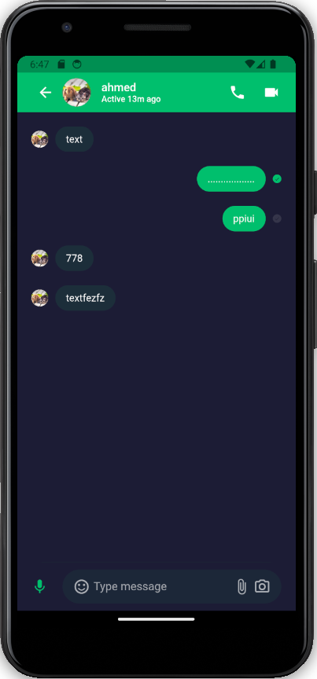

# chat application ( messenger )

was supposed to be full-stack but got bored and abandoned the api

laravel api

    

|login                      |  home                     | chat                      |
|:-------------------------:|:-------------------------:|:-------------------------:|
|    |     |     |

